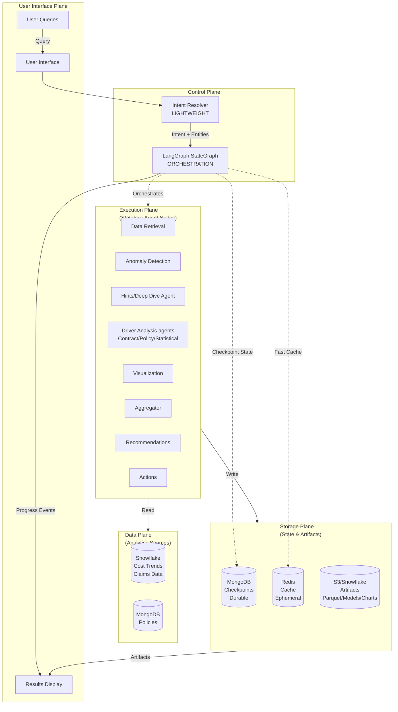

# System Architecture: Layered Planes

## Design principles

1. **Separation of Concerns**
   - **Orchestrator** = Planning and replanning logic
   - **Executor** = Graph traversal and execution engine  
   - **Agents** = Stateless workers with standard contracts

2. **Durable State**
   - All Graph structures, node states, and artifacts persisted in **StateGraph**
   - Graph nodes supports loops, allowing agents to iterate, refine, and correct their actions.
   - Enables pause/resume at any node.
   - Full audit trail of plan evolution.  
   ~~- Cycles where nodes review and refine their work.~~

3. **Controlled dynamic planning**
   - The Orchestrator can add, cancel, skip, ~~or deepen~~ branches at decision gates.
   - Agents are reusable building blocks that can sit anywhere in the DAG.

4. **Parallelization First**
   - Executor automatically parallelizes independent nodes.
   - No manual coordination needed.

5. **Human in Loop**
    - Human can pause or cancel the process.
    - Require human approval before implementing recommendations.

6. **Action Execution**
    - Takes action such as creating jira ticket, adding work to queue, sending email, etc.

~~7. **PHI-aware operation**~~.   
   ~~- Access control, auditability, and redaction are first-class design rules.~~

~~8. **Simulation mode**~~.       
   ~~- Users can simulate conditions and understand their impacts.~~

### Architecture Diagram

### Plane Responsibilities

#### **User Interface Plane**
- Thin rendering layer
- Displays status events from LangGraph
- Shows artifacts from S3/Snowflake
- No business logic

#### **Control Plane**
- Intent & Context Resolver
- Orchestrator / Plan Compiler to create Graph
- Artifact Registry
- Event Bus / Status Stream
- Access control, audit, and policy enforcement

#### **Execution Plane**
Responsible for actual investigation work.
- Stateless agent nodes (pure functions)
- Standard input/output contracts
- No knowledge of graph structure
- Reusable across different workflows
- Event Bus / Status Stream
- **Different agents such as**
    - Query & Code Composer
    - Data Access & Validation
    - Outlier Detection
    - Driver Analysis agents
    - Evidence Correlator
    - Ranking / Scoring
    - Visualization Composer
    - Quality Gate
    - Answer & Report Synthesizer
    - Recommendations
    - Actions
    - Optional advanced branches such as Attribution Modeling and Forecasting

## Investigation lifecycle

### 1. Resolve
- normalize the user question,
- extract entities and constraints,
- identify expected deliverables

### 2. Compile
- choose and chain agents, 
- bind parameters and artifacts,
- persist the initial Graph,
- publish starting status events.

### 3. Execute
- load required data,
- detect outliers or material deltas,
- fan out across driver branches,
- correlate evidence,
- rank findings.

### 4. Validate and synthesize
- check evidence sufficiency,
- verify numeric consistency,
- produce charts, answer text, and report payloads,
- block or downgrade outputs that are not publication-safe.

### 5. Generate Recommendations and actions
- present recommendation and action items to the user
- wait for user to approve or provide feedback
- take action

### 6. Export
- create downloadable artifacts such as markdown, PDF payloads, or presentation-ready outputs.

## Technology Stack Summary

| Layer | Component | Purpose | 
|-------|-----------|---------|
| **Data** | Snowflake | Analytics queries (OLAP) |
| **Data** | MongoDB | Policy documents + checkpoints |
| **Control** | LangGraph | Orchestration engine |
| **Storage** | Redis | Cache + fast checkpoints |
| **Storage** | S3/Snowflake | Artifacts (parquet, models) |
| **UI** | Streamlit | User interface | Compute only |

**Note**: MongoDB serves dual purpose - policy documents AND checkpoint storage (no separate database needed).